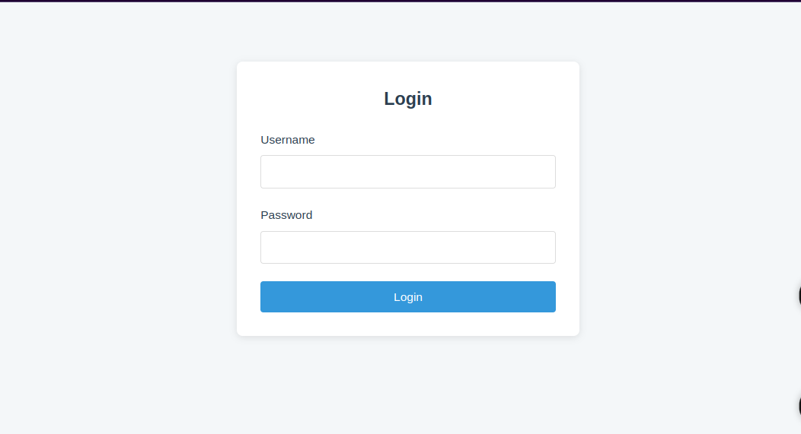
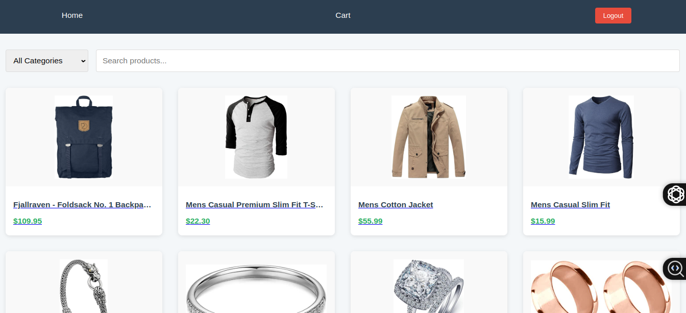

# Fake Store React Shopping Website

 
 <!-- Add your screenshot later -->

A modern e-commerce shopping website built with React.js using the Fake Store API. This project includes user authentication, product browsing, cart management, and responsive design.

## Features

- **User Authentication**
  - Login with username/password
  - JWT token storage
  - Protected routes

- **Product Browsing**
  - View all products
  - Filter by category
  - Search functionality
  - Product detail pages

- **Shopping Cart**
  - Add/remove products
  - Adjust quantities
  - Calculate total price
  - Checkout process

- **Responsive Design**
  - Mobile-first approach
  - Works on all screen sizes
  - Clean, modern UI

## Tech Stack

- **Frontend**
  - React.js (Vite)
  - React Router v6
  - Context API (State Management)
  - CSS (No frameworks)

- **API**
  - [Fake Store API](https://fakestoreapi.com)

## Installation

1. Clone the repository:
   ```bash
   git clone https://github.com/your-username/fake-store-react.git
   cd fake-store-react

   ```

2. Install Dependencies
   ```bash
   npm install

   ```

3. Start the development Server
   ``bash
   npm run dev

   ```

4. Open your browser
   ```bash
   http://localhost:5173

   ```

## Project Structure

src/
├── components/       # Reusable components
├── context/          # Global state management
├── hooks/            # Custom hooks
├── pages/            # Page components
├── styles/           # CSS files
├── App.jsx           # Main application
└── main.jsx          # Entry point

